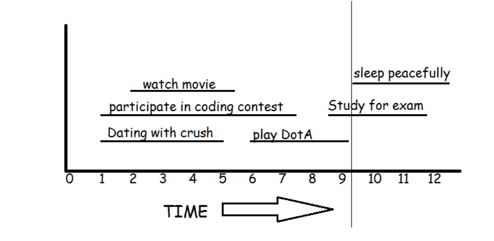

## BUSYMAN - I AM VERY BUSY

You are actually very busy man. You have a big schedule of activities. Your aim is to do as much as activities as possible.

<center>


<figcaption>Figura 1: Exemplo do horario</figcaption>

</center>

In the given figure, if you go to date with crush, you cannot participate in the coding contest and you can’t watch the movie. Also if you play DotA, you can’t study for the exam. If you study for the exam you can’t sleep peacefully. The maximum number of activities that you can do for this schedule is 3. 

Either you can

 - watch movie, play DotA and sleep peacefully (or)
 - date with crush, play DotA and sleep peacefully

<a>Input Specifications</a>

The first line consists of an integer T, the number of test cases. For each test case the first line consists of an integer N, the number of activities. Then the next N lines contains two integers m and n, the start and end time of each activity.

<a>Output Specifications</a>

For each test case find the maximum number of activities that you can do.

 ### Example 

 INPUT
 ```jsx
3
3
3 9
2 8
6 9

4
1 7
5 8
7 8
1 8

6
7 9
0 10
4 5
8 9
4 10
5 7
```
OUTPUT
 ```jsx
1
2
3
```
