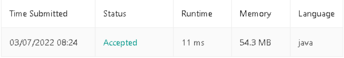

# Solved_Questions

**Número da Lista**: 18

**Conteúdo da Disciplina**: Greed Algorithms

## Alunos
|Matrícula | Aluno |
| -- | -- |
| 18/0100831  |  Gabriel Avelino |
| 18/0103431  |  João Victor Valadão |

## Sobre 
Nesse projeto iremos resolver questões de Online Judges usando Greed Algorithms.

## Apresentação

Link do vídeo da apresentação:

[](https://www.youtube.com/watch?v=nhLl3Y-iSHM)

## Screenshots

<center>


<figcaption>Figura 1: Accepted Questão 1</figcaption>

</br>


<figcaption>Figura 2: Accepted Questão 2</figcaption>

</br>


<figcaption>Figura 3: Accepted Questão 3</figcaption>

</br>

</center>

## Instalação 
**Linguagem**: C/Java<br>
**Framework**: não existe<br>
Poder rodar programas em C e ter Java instalado.

## Uso 
Execute a questão 1 com os seguintes comandos:
```jsx
Navegue até o diretório que o arquivo se encontra
gcc scheduling.c
./a.out
```
Execute a questão 2 com os seguintes comandos:
```jsx
Navegue até o diretório que o arquivo se encontra
javac .\Solution.java
java Solution
```
Execute a questão 3 com os seguintes comandos:
```jsx
Navegue até o diretório que o arquivo se encontra
javac .\Solution.java
java Solution
```


